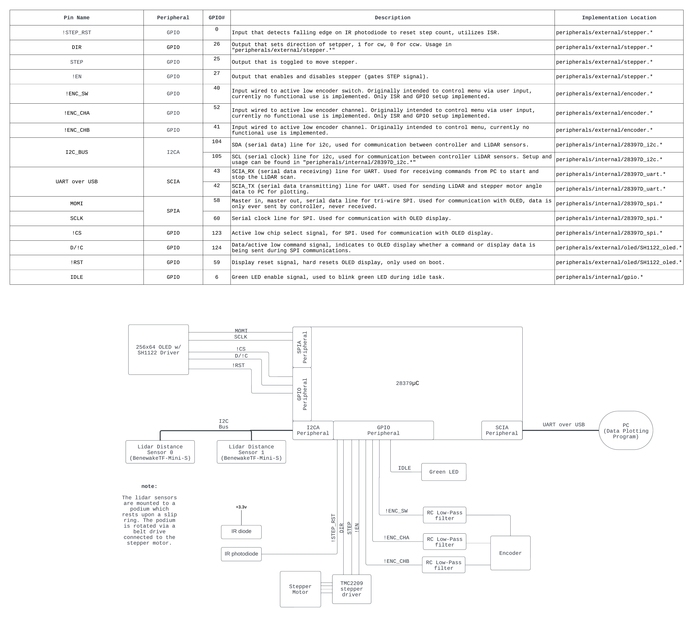
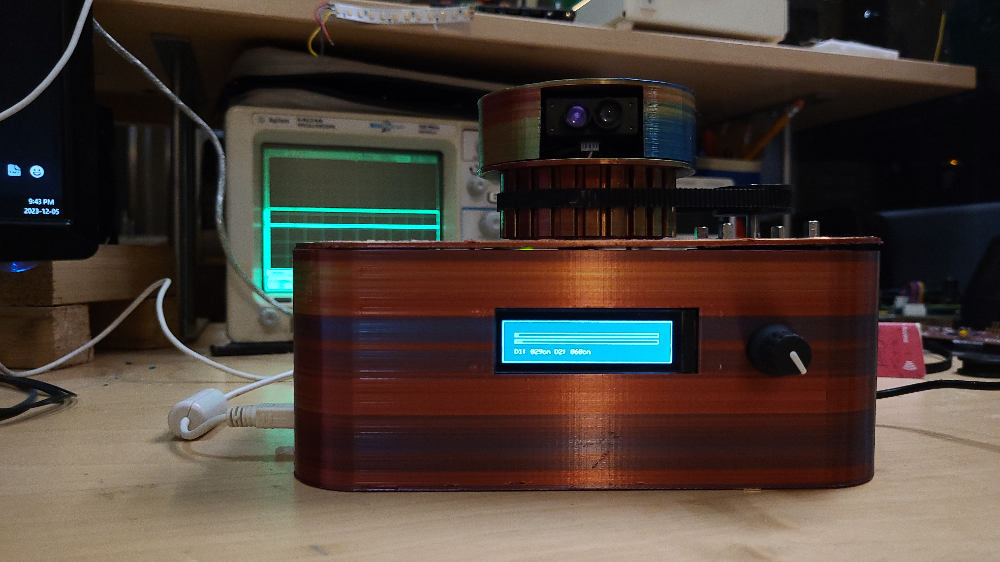
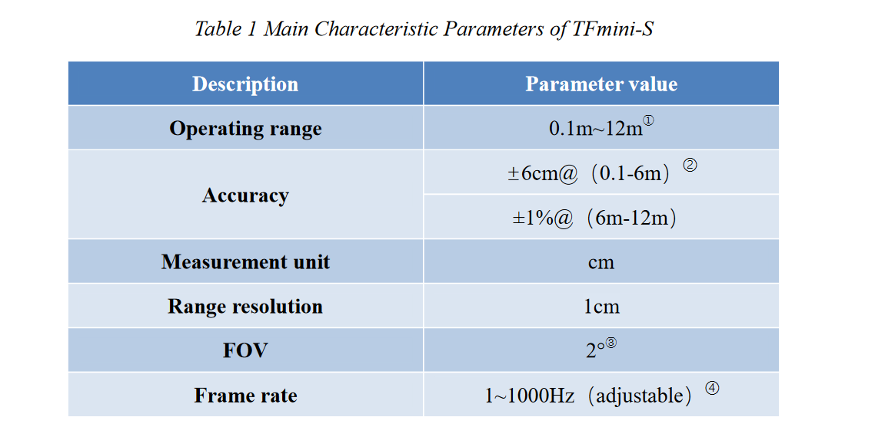
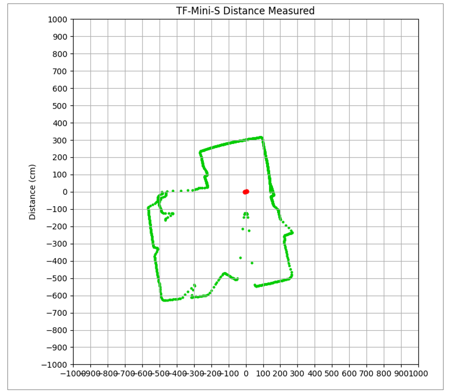
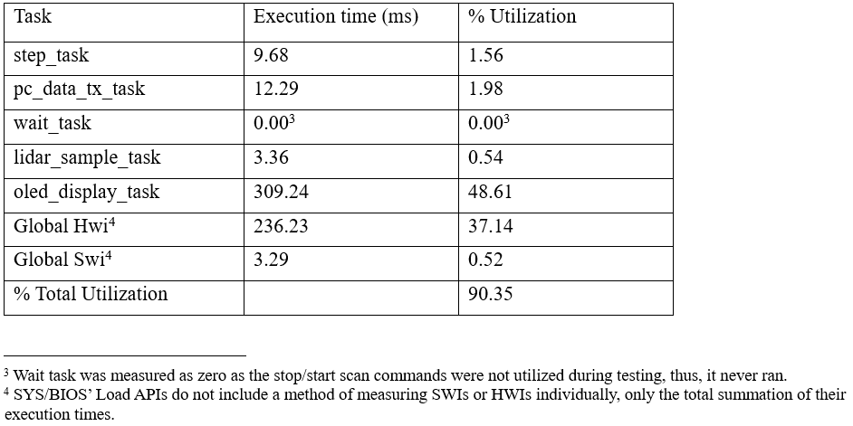

Table of Contents

<ol>
<li><a href="#about">About</a></li>
<li><a href="#system-overview">System Overview</a></li>
<li><a href="#prototype-device">Prototype Device</a></li>
<li>
    <a href="#results">Results</a>
    <ul>
    <li><a href="#accuracy">Accuracy</a></li>
    <li><a href="#mapping-a-room">Mapping a Room</a></li>
    <li><a href="#cpu-utilization">CPU Utilization</a></li>
    </ul>
</li>
<li>
    <a href="#to-do">To Do</a>
    <ul>
    <li><a href="#hardware">Hardware</a></li>
    <li><a href="#firmware">Firmware</a></li>
    <li><a href="#pc-client">PC Client</a></li>
    </ul>
</li>
<li><a href="#license">License</a></li>
<li><a href="#contact">Contact</a></li>
</ol>

<!-- ABOUT -->
## About
Two dimensional lidar scanner project utilizing the TI F2837x launchpad development board with a tms320f28379D controller.

In its current state this project is fully functional, one working prototype has been constructed; however, a vast amount
of improvements could be made which are outlined in the "To Do" section. 

All firmware is currently written in C, with use of TI SYS/BIOS RTOS. The project also contains a plotting script written in
python that interprets the data from the controller and illustrates a map for the user to view. There is also a C++ plotting
program; however, its implementation is not yet completed. 

(<a href="#readme-top">back to top</a>)

## System Overview 
See below, a block diagram of the system and its interconnections. 

(<a href="#readme-top">back to top</a>)

## Prototype Device
See below, an image of the assembled prototype. There are a few mistakes in the CAD files that must be corrected before I feel 
comfortable releasing them, I will update this repo with them at some point. 

(<a href="#readme-top">back to top</a>)

## Results
Some very crude tests were performed to verify the functionality of the prototype which are outlined in this section. Further 
testing will be performed once more of the "To Do" section has been completed. 

### Accuracy
To test accuracy, the device was placed into a rectangular bin of a known size. Points were measured from the LiDAR sensors to
the edges of the bin in multiple locations with a measuring tape and compared to the map illustrated by the python client. 
It was determined that at close ranges, the device had no deviations greater than 3cm, well within spec according to the TF-Mini-S [product manual](https://cdn.sparkfun.com/assets/8/a/f/a/c/16977-TFMini-S_-_Micro_LiDAR_Module-Product_Manual.pdf). The relevant table from the manual is depicted below: 

 

### Mapping a Room
To determine if the accuracy still held up at ranges larger than 6m, the previous test was scaled up by generating a map of my suite. Note that the device was placed near the ceiling to avoid its view being obstructed by furniture and lab equipment.  
This test was a success, confirming that any distances greater than 6m were within 1% of their actual value. 

 

### CPU Utilization 
To test the CPU utilization API calls from TI SYS/BIOS load module were utilized, the results are summarized in the table below. The documentation for these functions can be viewed [here](https://software-dl.ti.com/dsps/dsps_public_sw/sdo_sb/targetcontent/sysbios/6_53_02_00/exports/bios_6_53_02_00/docs/cdoc/ti/sysbios/utils/Load.html).

 

The results indicated that there is a massive amount of processing time wasted by drawing to the OLED screen. This screen has no functional purpose beyond indicating when the device is in its zeroing state, or the most recent distance measured while it is in its scanning state. It will be removed in future revisions of the project. 

(<a href="#readme-top">back to top</a>)

## To Do

### Hardware 

- Make custom PCB to miniaturize device and avoid use of development board
- Update CAD files to fix mistakes in print (incorrect spacing on some mounting holes)
- Scale down and miniaturize enclosure for PCB
- Remove OLED display and encoder
- Switch to regular DC motor, eliminate use of stepper motor 

### Firmware

- Port from deprecated TI SYS/BIOS RTOS to freeRTOS
- Write driver for DC motor
- Update sampling algorithm/method for faster refresh rate (currently it is very high fidelity, but much too slow)

### PC Client 
- Finish CPP client 

(<a href="#readme-top">back to top</a>)

## License

Distributed under the GPL-3.0 License. See `LICENSE.md` for more information.

(<a href="#readme-top">back to top</a>)

## Contact

Myles Parfeniuk - myles.parfenyuk@gmail.com

Project Link: [https://github.com/myles-parfeniuk/2d_lidar_scanner_ti_28379D](https://github.com/myles-parfeniuk/2d_lidar_scanner_ti_28379D)

(<a href="#readme-top">back to top</a>)
